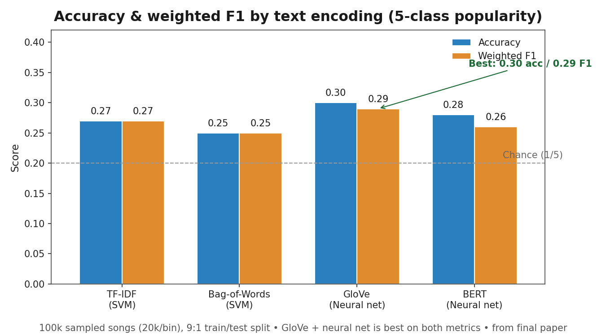
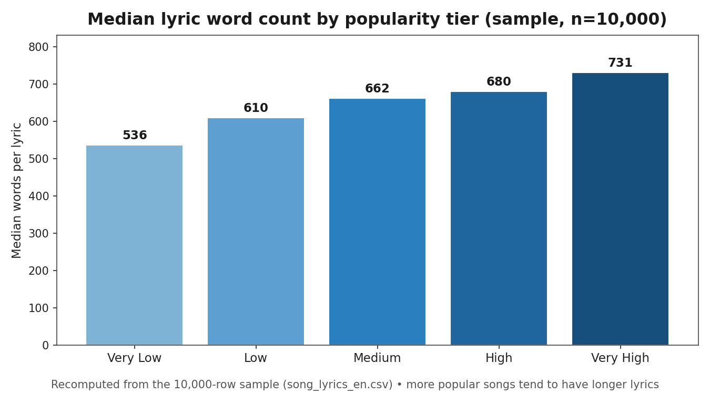
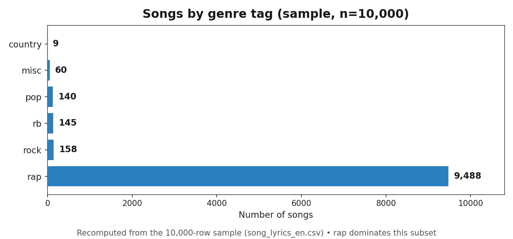
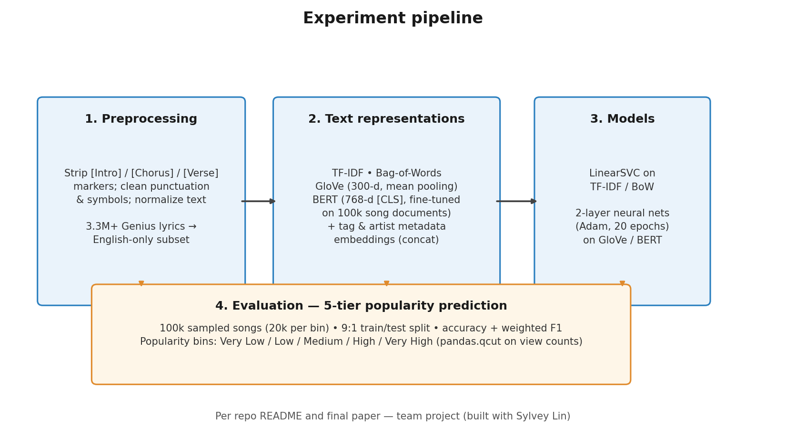

# Predicting Song Popularity through Lyrics and Features

Text mining final project (UIUC) — built with Sylvey Lin. Can we predict how popular a song will become from its lyrics and metadata? Using 3.3M+ Genius song lyrics, we framed popularity as a 5-way classification problem over binned view counts and compared classical and neural text representations.

## The idea

Streaming-era hits leave traces in language: repeated hooks, distinctive vocabulary, genre conventions. We combined **lyric text** (TF-IDF, Bag-of-Words, GloVe, fine-tuned BERT) with **metadata embeddings** (genre tags, artist + featured-artist embeddings) and asked which representation best predicts a song's popularity tier.

## Dataset

- **Genius Song Lyrics** (Kaggle), 3,374,189 records: lyrics, title, artist, featured artists, genre tag, view counts
- English-only subset included here: `data/song_lyrics_en.csv` (~807k songs)
- Target: view counts → **quantile-binned into 5 popularity tiers** (Very Low / Low / Medium / High / Very High) with `pandas.qcut`, ~674k songs per bin

## Pipeline

1. **Preprocessing** — strip song-part indicators (`[Intro]`, `[Chorus]`, `[Verse]`), clean punctuation/symbols from feature fields, normalize text
2. **Representations**
   - *Text*: TF-IDF, Bag-of-Words, GloVe (`en_core_web_md`, 300-d mean pooling), BERT (`bert-base-uncased`, fine-tuned on 100k song documents, 768-d `[CLS]`)
   - *Metadata*: tag embeddings (2-d), artist embeddings (600-d over 429k artists); featured-artist embeddings averaged in
   - Song vector = concat(tag, artist, document embeddings)
3. **Models** — `LinearSVC` on TF-IDF/BoW; 2-layer neural nets (Adam, 20 epochs) on GloVe/BERT
4. **Evaluation** — 100k sampled songs (20k per bin), 9:1 train/test split, accuracy + weighted F1

## Results

| Text encoding | Model | Accuracy | Weighted F1 |
|---|---|---|---|
| TF-IDF | SVM | 0.27 | 0.27 |
| Bag-of-Words | SVM | 0.25 | 0.25 |
| GloVe | Neural net | **0.30** | **0.29** |
| BERT | Neural net | 0.28 | 0.26 |

Takeaways: GloVe's frequency-aware embeddings beat contextual BERT here — in lyrics, *repetition* (hooks, choruses) carries signal that pure contextual models underweight. Ablation showed tag/artist metadata consistently lifts every model. Full analysis in `reports/final_paper.pdf`.

## What's in this repo

```
├── data/
│   ├── small_file.csv          # raw lyrics sample (~816k rows; input to preprocessing)
│   ├── song_lyrics_en.csv      # English-only lyrics subset (~807k rows, binned)
│   ├── tag_embeddings.npy      # trained tag embeddings
│   ├── pip_requirements.txt    # original pip environment
│   └── ORIGINAL_SETUP_README.md
├── notebooks/
│   ├── setup.ipynb                 # environment & data setup
│   ├── scratch_env_setup.ipynb   # early env/data-loading scratch notes
│   ├── preprocessing.ipynb         # lyric cleaning, feature cleaning, qcut binning
│   ├── Bin.ipynb                   # popularity-bin construction
│   ├── attribute_embeddings.ipynb  # tag + artist embedding training
│   ├── SVC.ipynb                   # LinearSVC on TF-IDF / Bag-of-Words
│   ├── SVR.ipynb                   # SVR experiments
│   └── neural_nets_glove_bert.ipynb  # GloVe/BERT + 2-layer NN (reconstructed from paper §5.2.2)
├── reports/
│   ├── proposal.pdf            # original project proposal
│   ├── final_paper.pdf         # full paper
│   └── final_presentation.pdf  # slide deck
├── requirements.txt
└── README.md
```

## Reproduce

The dataset is already preprocessed and binned (`popularity_bin` column). Load tag embeddings with `np.load('data/tag_embeddings.npy')`. Run the notebooks in order: `setup` → `preprocessing` → `Bin` → `attribute_embeddings` → `SVC` / `SVR` / `neural_nets_glove_bert`. See `data/ORIGINAL_SETUP_README.md` for the original environment setup notes.

## Visualizations




